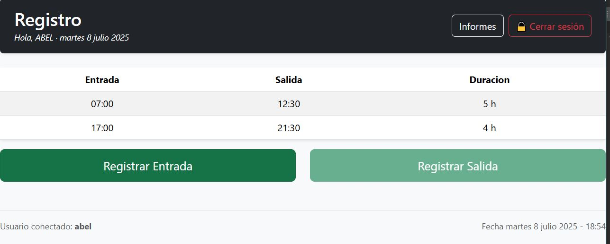
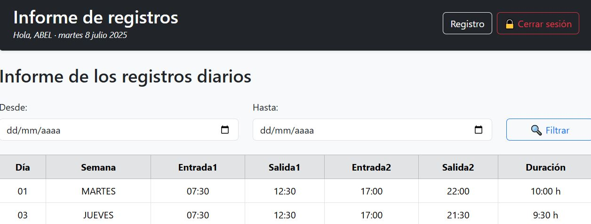
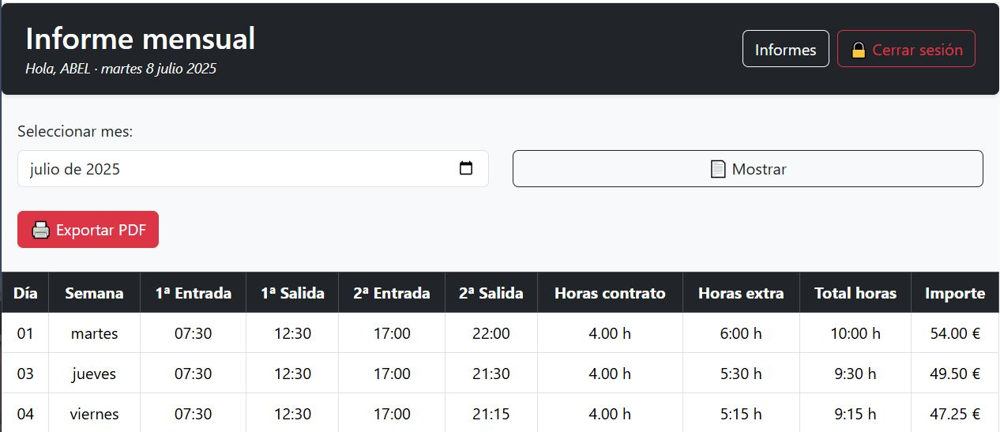

# 🕒 control-horas-app

Aplicación para llevar un control de las horas trabajadas.
Es una buena opcion para llevar el control de tu tiempo.

---

## ⚙️ Funcionalidades principales

- Registro y autenticación de usuarios con **Spring Security** y **BCryptPasswordEncoder**
- Registro de entradas/salidas y cálculo automático de tiempo trabajado
- Generación de informes en PDF con **ITextRenderer**
- Persistencia de datos usando **Spring Data JPA** y **H2**
- API REST clara, estructurada y extensible

---

## 🛠️ Tecnologías empleadas

| Tecnología           | Uso                                  |
|----------------------|---------------------------------------|
| Spring Boot          | Framework principal                   |
| Spring Security      | Autenticación y autorización          |
| BCryptPasswordEncoder| Encriptación de contraseñas           |
| H2 Database          | Base de datos para desarrollo         |
| ITextRenderer        | Generación de PDF desde HTML          |
| Maven                | Gestión de dependencias y compilación |

---

## ▶️ Cómo ejecutar el proyecto

### Una vez entramos en la página podemos registrar las horas o acceder a los informes



### En los informes podemos encontrar filtros de búsqueda por fecha



### Podemos extraer informes personalizados en PDF del mes que necesitemos



---

## 📂 Estructura del proyecto

```plaintext
control-horas-app/
├── src/
│   ├── main/java/…       → Código fuente (controladores, servicios, entidades)
│   ├── main/resources/   → Configuración (`application.properties`)
│   └── test/java/…       → Tests automatizados
├── pom.xml               → Configuración del proyecto Maven
├── mvnw / mvnw.cmd       → Scripts para usar Maven sin instalación global
├── README.md             → Documentación del proyecto

```

---

## 🛡️ Licencia

Este proyecto se distribuye bajo la licencia **MIT**.  
Puedes usarlo, modificarlo y compartirlo libremente.

---

## 🤝 Contribuciones

¿Tienes ideas para mejorar esta app o quieres participar?  
Las pull requests son bienvenidas, y también puedes abrir un *issue* para reportar errores o proponer nuevas funcionalidades.

---

## 📫 Contacto

Desarrollado por **Abel Coro**  
🔗 GitHub: [@Acoro47](https://github.com/Acoro47)

---

## ✨ Gracias

Gracias por visitar este repositorio.  
Espero que te sea útil o inspirador para tus propios proyectos.  
Si te ha gustado, deja una estrella ⭐ en GitHub. ¡Nos vemos en el código!